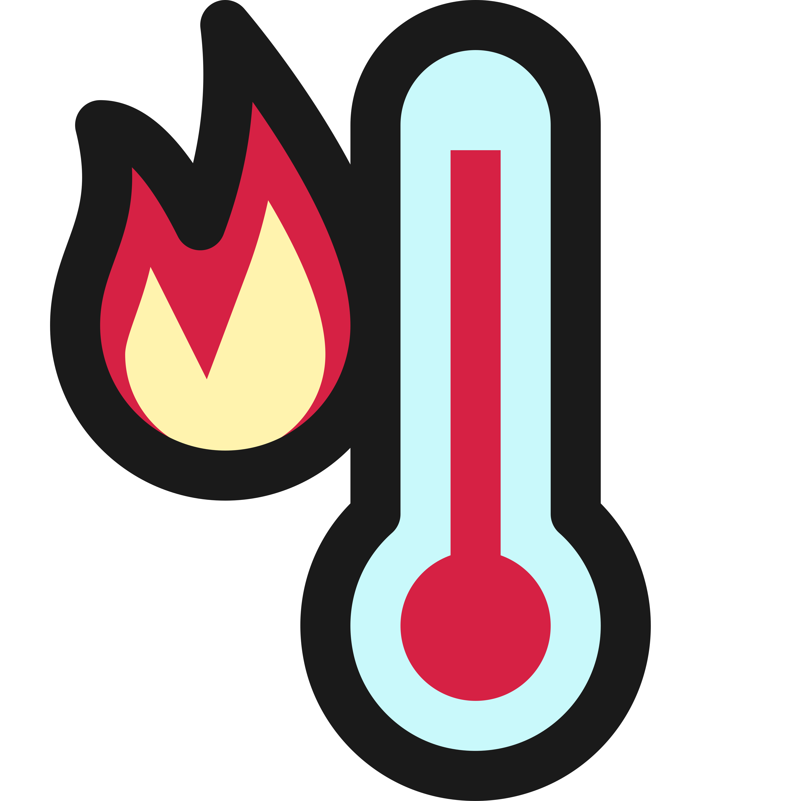

  

 

 # Conversor de Temperatura
  
> Conversor de Temperaturas de escala Celsius, Farenheit e Kelvin. Projeto idealizado pela [ImersãoDev da Alura](https://imersao.dev/), do ano de 2022. O código foi editado e personalizado por mim. 
>
>Quer ver como fica ele funcionando em um navegador? [Clique aqui](https://sntempconvert.netlify.app/)
>

# Versão
> Este projeto a princípio não possui um sistema de versionamento. 

# Licença
> Todos os direitos reservados © [Sarah Nideck](https://github.com/sarahnideck)

